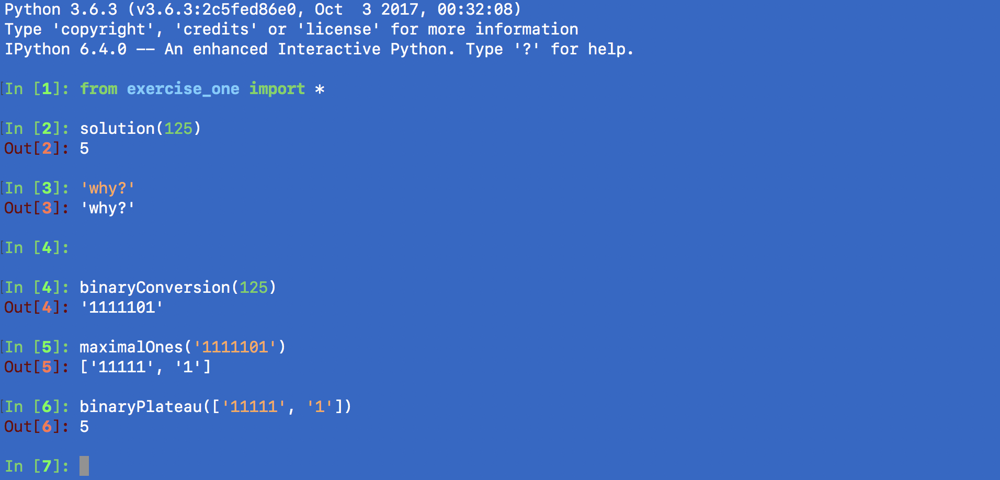

# Ex1
## Binary Plateau
Solutions are in a file called 'exercise_one.py', containing four methods. The method 'solution()' runs all the other methods, to return the Binary Plateau, or any maximal sequence of consecutive ones in the binary representation of N. The 3 other methods show the incremental steps to a solution. binaryConversion() converts the inputted integer into a Binary. maximalOnes() takes the converted Binary and returns a list of all the consecutive ones. Finally, the method binaryPlateau() returns the length of the longest consecutive one chain, or the Binary Plateau.



# Ex2
## Event API
### To Test
We change into the test directory, and run the following command to run all tests.
```
cd test
```
```
python -m unittest discover
```

### To Run
Run the following command to initialise a database. This creates a table called 'events', and populates it with some sample data to interact with.
```
python init_db.py
```
```
export FLASK_APP=app.py
export FLASK_ENV=development
flask run
```
### Endpoints
The following endpoints are available:
```
GET /api/events/
```
- Returns all events in Database
```
GET /api/events/:id/
```
- Returns an event, specified by ID
```
POST /api/events/:start/:end/:label/:category/
# e.g.: /api/events/'2016-08-01T10:00:00Z'/'2016-08-01T15:00:00Z'/'Event one'/'blue'/
```
- Creates an event with attributes. All attributes must be included, and written between single quotes.
```
GET /api/events/:id/export/
```
- Exports an event as an ICS file. Event specified by ID.
```
GET /api/events/:id/delete/
```
- Deletes an event, specified by ID

## Notes
SQLite is convenient because it doesn’t require setting up a separate database server and is built-in to Python.

Why flask? Lightweight, simple frame-work. lack of frills means that it's easy to debug

I used PostMan to test API responses- intuitive interface, stops me from saving/downloading ics files a lot as it renders them instead.
, and verified them in browser using Firefox - cool and clean UI, and needed to test it through more common usepoint, and check attachment downloadability and whether they open

what would I do with more time?
complete all features
add setup and teardown methods to refactor tests better
put all of the module and class code into its own folder
maybe have the db_init script run automatically at start
